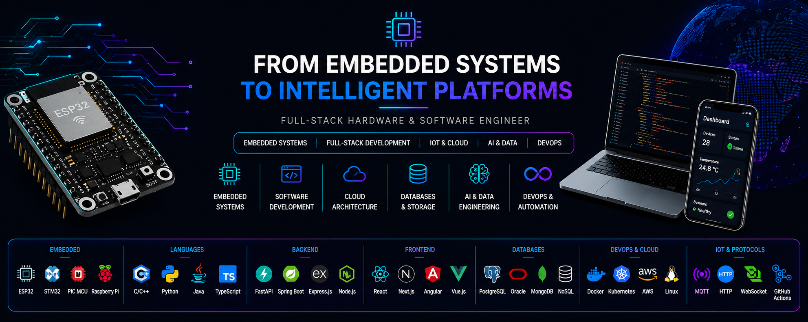

<!-- ========================================================= -->
<!--                      HERO SECTION                          -->
<!-- ========================================================= -->

<p align="center">
  
</p>

<br>

<div align="center">

# 👋 Hello, I'm Nangndi Wabede

### Electronics & Control Engineer • Computer Scientist

### Engineering Intelligent Systems from **Embedded Devices** to **Enterprise Platforms**

<br>


<br><br>


</div>

---

# 🏛 Engineering Philosophy

I am an **Electronics & Control Engineer** with a multidisciplinary background spanning **Computer Science**, **Embedded Systems**, **Artificial Intelligence**, **Telecommunications**, **Enterprise Infrastructure**, **Industrial IoT**, **Cloud Engineering**, and **Modern Software Engineering**.

My passion is designing engineering platforms where **hardware, software, networking, cloud technologies and intelligent algorithms** work together to solve real-world challenges.

I believe the future belongs to engineers capable of bridging multiple disciplines into cohesive, scalable and production-ready systems.

> **Building intelligent systems where Electronics, Software and Artificial Intelligence converge.**

---
<!-- ========================================================= -->
<!--                  ENGINEERING DOMAINS                       -->
<!-- ========================================================= -->

<div align="center">

# ⚙ Engineering Domains

*Building multidisciplinary engineering solutions across hardware, software, connectivity and intelligent systems.*

</div>

<br>

| Engineering Domain | Focus |
|:-------------------|:------|
| ⚡ **Electronics Engineering** | Intelligent electronic systems, signal acquisition, instrumentation and hardware design |
| 🔌 **Embedded Systems** | Firmware development, RTOS, microcontrollers, edge computing and embedded architectures |
| 🤖 **Artificial Intelligence** | Computer Vision, Machine Learning, TinyML and intelligent decision-making systems |
| 📡 **Industrial IoT** | Telemetry, smart devices, sensor networks and connected platforms |
| 🌐 **Telecommunications & Networking** | Enterprise networking, routing, switching, wireless communications and carrier-grade infrastructures |
| ☁️ **Cloud Engineering** | Distributed systems, cloud-native services, containerization and scalable infrastructures |
| 🏢 **Enterprise Infrastructure** | Windows, Linux, virtualization, systems administration and IT consulting |
| 💻 **Software Engineering** | Full-stack web applications, backend APIs, distributed platforms and automation |
| 🔒 **Cybersecurity** | Secure infrastructures, authentication, access control and resilient engineering platforms |
| 🔬 **Research & Innovation** | Emerging technologies, multidisciplinary engineering and applied research |

---

<div align="center">

## 🧭 Engineering Vision

*"The most impactful engineering solutions are built at the intersection of multiple disciplines—not within the boundaries of a single one."*

</div>

---
<!-- ========================================================= -->
<!--                TECHNOLOGY ECOSYSTEM                        -->
<!-- ========================================================= -->

<div align="center">

# 💻 Technology Ecosystem

*Technologies supporting the design, development and deployment of multidisciplinary engineering platforms.*

</div>

---

# ⚡ Electronics & Embedded Systems

<p align="center">


<br><br>


</p>

<br>

<div align="center">

### 🛠 Engineering Design Tools


</div>

---

# 💻 Programming Languages

<p align="center">


</p>

---

# 🌐 Software Engineering

<p align="center">


</p>

---

# 🗄 Databases & Data Platforms

<p align="center">


<br><br>


</p>

---

# 📡 Telecommunications & Networking

<p align="center">


</p>

---

# ☁ Cloud, DevOps & Automation

<p align="center">


<br><br>


</p>

---

# 🏢 Enterprise Infrastructure

<p align="center">


</p>

---

# 🤖 Artificial Intelligence & Data Engineering

<p align="center">


</p>

---

<!-- ========================================================= -->
<!--                ENGINEERING ECOSYSTEM                       -->
<!-- ========================================================= -->

<div align="center">

# 🚀 Engineering Ecosystem

### A multidisciplinary engineering ecosystem spanning electronics, embedded systems, artificial intelligence, telecommunications, enterprise infrastructure and cloud platforms.

</div>

---

<div align="center">

| Platform | Engineering Focus | Status |
|:---------|:------------------|:------:|
| 🌐 **HendyWab Portfolio** | Professional engineering portfolio & personal brand | 🚧 |
| 🏢 **ChendyTronics** | Engineering & technology ecosystem | 🚀 |
| ⚙ **ChendyForge** | Engineering collaboration & development platform | 🚧 |
| 👥 **ChendyPresence** | Workforce Intelligence Platform | 🚧 |
| 📡 **ChendyIoT** | Industrial IoT & telemetry platform | 🚧 |
| 👁 **ChendyVision** | Computer Vision & AI systems | 🚧 |
| 💻 **HendyWab IT Labs** | Enterprise Infrastructure Engineering | 🚧 |
| 🌐 **Telecom Systems & Network Engineering** | Carrier-grade networking & telecom labs | 🚧 |
| 🔬 **IEDS Diagnostic Workbench** | Intelligent Embedded Diagnostics | 🚧 |

</div>

---

## 🏛 Engineering Architecture

```text
                           HendyWab
                               │
     ┌─────────────────────────┼─────────────────────────┐
     │                         │                         │
 Portfolio               ChendyTronics             Research
     │                         │
     │          ┌──────────────┼──────────────┐
     │          │              │              │
     │     ChendyForge   ChendyPresence   ChendyVision
     │          │              │              │
     │          └──────┬───────┴──────────────┘
     │                 │
     │            ChendyIoT
     │                 │
     ├─────────────────┼───────────────────────┐
     │                 │                       │
 IT Labs      Telecom Engineering         IEDS Platform
```

---

<div align="center">

### 🎯 Engineering Mission

**Designing intelligent engineering platforms that connect hardware, software, artificial intelligence, networking and cloud technologies into scalable real-world solutions.**

</div>

---
<!-- ========================================================= -->
<!--              FLAGSHIP ENGINEERING PLATFORMS               -->
<!-- ========================================================= -->

<div align="center">

# ⭐ Flagship Engineering Platforms

</div>

---

## 🔬 Intelligent Embedded Diagnostic System (IEDS)

AI-assisted embedded diagnostics platform integrating intelligent electronics, telemetry, cloud technologies and modern software engineering.

### Core Technologies

- Embedded Systems
- Artificial Intelligence
- MQTT
- WebSockets
- FastAPI
- React
- PostgreSQL

---

## 👥 ChendyPresence

Enterprise Workforce Intelligence Platform featuring intelligent attendance management, access control, analytics and cloud-native services.

### Core Technologies

- Facial Recognition
- RFID
- Enterprise Cloud
- REST APIs
- PostgreSQL
- React
- FastAPI

---

## 📡 ChendyIoT

Industrial IoT platform enabling real-time telemetry, connected devices, monitoring dashboards and distributed engineering infrastructures.

### Core Technologies

- MQTT
- WebSockets
- Docker
- PostgreSQL
- React
- FastAPI

---

## 🌐 Telecom Systems & Network Engineering

Carrier-grade networking portfolio demonstrating enterprise networking, telecommunications, infrastructure automation and cloud networking.

### Focus Areas

- Routing & Switching
- VLAN
- VPN
- Linux Networking
- Network Automation
- Enterprise Infrastructure
- Cloud Networking

---

## 💻 HendyWab IT Labs

Enterprise Infrastructure Engineering portfolio covering Windows, Linux, networking, cloud administration, automation and professional IT consulting.

### Focus Areas

- Windows Administration
- Linux Administration
- Enterprise Networking
- Virtualization
- Active Directory
- Docker
- Infrastructure Automation

---

## ⚙ ChendyForge

Engineering collaboration platform supporting software engineering workflows, documentation and multidisciplinary engineering projects.

---

<div align="center">

### More flagship engineering platforms are continuously being designed and developed as part of the HendyWab Engineering Ecosystem.

</div>

---
<!-- ========================================================= -->
<!--             RESEARCH & CURRENT FOCUS                       -->
<!-- ========================================================= -->

<div align="center">

# 🔬 Research & Innovation

*"Engineering is not only about solving today's problems, but about creating tomorrow's technologies."*

</div>

---

My research and engineering activities focus on designing intelligent, connected and scalable systems by combining multiple engineering disciplines.

Current areas of exploration include:

- 🤖 Artificial Intelligence & Machine Learning
- 🔌 Intelligent Embedded Systems
- ⚡ Electronics & Control Engineering
- 📡 Industrial Internet of Things (IIoT)
- 🌐 Telecommunications & Enterprise Networking
- ☁ Cloud-native Engineering Platforms
- 🏢 Enterprise Infrastructure Engineering
- 🔒 Secure Connected Systems
- ⚙ Engineering Automation
- 📊 Real-time Telemetry & Distributed Observability

---

<div align="center">

## 🧠 Research Philosophy

*"Innovation happens where engineering disciplines intersect."*

</div>

---

<div align="center">

# 🎯 Current Engineering Focus

<table>
<tr>

<td width="50%" valign="top">

### 🧠 Intelligent Engineering

- AI-assisted diagnostics
- Intelligent embedded platforms
- Edge AI
- TinyML
- Industrial Automation

</td>

<td width="50%" valign="top">

### 🌐 Infrastructure

- Enterprise Networking
- Telecommunications
- Linux Infrastructure
- Cloud Platforms
- Enterprise Automation

</td>

</tr>

<tr>

<td valign="top">

### ⚙ Embedded Platforms

- STM32
- ESP32
- RTOS
- PCB Design
- Instrumentation

</td>

<td valign="top">

### 💻 Software Platforms

- FastAPI
- React
- Next.js
- PostgreSQL
- Distributed Systems

</td>

</tr>

</table>

</div>

---

<div align="center">

## 🚀 Vision

Designing engineering platforms that seamlessly integrate

⚡ **Electronics**

↓

🔌 **Embedded Systems**

↓

📡 **Connectivity**

↓

☁ **Cloud**

↓

🤖 **Artificial Intelligence**

↓

🌍 **Real-World Applications**

</div>

---
<!-- ========================================================= -->
<!--                 ENGINEERING ROADMAP                        -->
<!-- ========================================================= -->

<div align="center">

# 🛣 Engineering Roadmap

</div>

---

## 📍 Current Journey

```text
Electronics Engineering
          │
          ▼
Embedded Systems
          │
          ▼
Artificial Intelligence
          │
          ▼
Industrial IoT
          │
          ▼
Enterprise Infrastructure
          │
          ▼
Telecommunications
          │
          ▼
Cloud Engineering
          │
          ▼
Distributed Engineering Platforms
          │
          ▼
Intelligent Enterprise Systems
```

---

## 🌍 Long-Term Engineering Objectives

✔ Intelligent Embedded Platforms

✔ Enterprise Infrastructure Engineering

✔ Carrier-Grade Telecommunications

✔ Industrial IoT Ecosystems

✔ Cloud-native Engineering

✔ Artificial Intelligence Integration

✔ Engineering Research

✔ Open Source Engineering Platforms

✔ Professional IT Consulting

✔ Engineering Education

---

<div align="center">

### Every project within this GitHub ecosystem contributes toward a unified engineering vision.

</div>

---
<!-- ========================================================= -->
<!--                  ENGINEERING ACTIVITY                      -->
<!-- ========================================================= -->

<div align="center">

# 📊 Engineering Activity

</div>

<p align="center">


<br><br>


</p>

---

<div align="center">

### Engineering is a continuous process of learning, building and improving.

</div>

---
<!-- ========================================================= -->
<!--                PROFESSIONAL NETWORK                        -->
<!-- ========================================================= -->

<div align="center">

# 🌐 Professional Network

*Let's connect and build the next generation of intelligent engineering platforms.*

</div>

<br>

<p align="center">

<a href="https://linkedin.com/in/nangndi-wabede">


</a>

&nbsp;&nbsp;&nbsp;

<a href="https://github.com/HendyWab">


</a>

</p>

---

<div align="center">

### Engineering Portfolio

🚧 Coming Soon

Professional portfolio showcasing engineering platforms,
research projects,
technical documentation,
and enterprise architectures.

</div>

---

<div align="center">

### ChendyTronics Engineering Ecosystem

Building multidisciplinary engineering platforms spanning

⚡ Electronics

🔌 Embedded Systems

🤖 Artificial Intelligence

📡 Industrial IoT

🌐 Telecommunications

☁ Cloud Engineering

🏢 Enterprise Infrastructure

💻 Software Engineering

</div>

---
<!-- ========================================================= -->
<!--                ENGINEERING PRINCIPLES                      -->
<!-- ========================================================= -->

<div align="center">

# ⚙ Engineering Principles

</div>

<br>

<table>

<tr>

<td align="center" width="33%">

### 🎯 Purpose

Every project should solve a real engineering problem.

</td>

<td align="center" width="33%">

### ⚡ Simplicity

Simple architectures outperform unnecessary complexity.

</td>

<td align="center" width="33%">

### 🚀 Scalability

Design today with tomorrow's systems in mind.

</td>

</tr>

<tr>

<td align="center">

### 🔬 Research

Engineering evolves through continuous learning.

</td>

<td align="center">

### 🤝 Collaboration

Knowledge grows when it is shared.

</td>

<td align="center">

### 🌍 Impact

Technology should improve real-world systems.

</td>

</tr>

</table>

---
<!-- ========================================================= -->
<!--                   ENGINEERING MOTTO                        -->
<!-- ========================================================= -->

<div align="center">

# 💡 Engineering Motto

## From Embedded Systems

↓

## To Intelligent Platforms

<br>

Building multidisciplinary engineering solutions where

**Electronics**

↓

**Embedded Systems**

↓

**Networking**

↓

**Cloud**

↓

**Artificial Intelligence**

↓

**Real-World Impact**

</div>

---
<!-- ========================================================= -->
<!--                        FOOTER                              -->
<!-- ========================================================= -->

<div align="center">


<br><br>

### Thanks for visiting my GitHub!

If you enjoy engineering, embedded systems,
AI, cloud technologies,
telecommunications,
or enterprise infrastructure,

⭐ feel free to explore my repositories.

<br>

*"Engineering tomorrow's intelligent systems, one platform at a time."*

</div>

